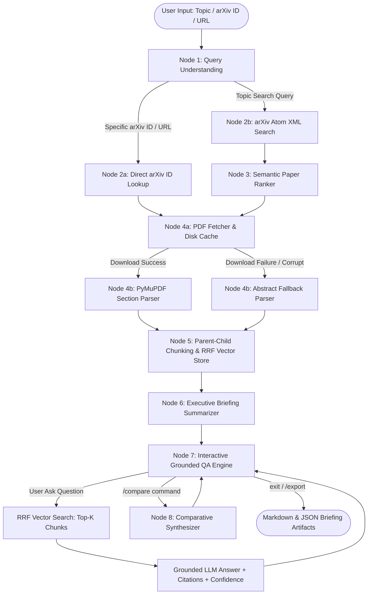

# System Architecture & Technical Specification

## Project: Autonomous arXiv Paper Digest & Grounded QA Agent

---

## 1. High-Level Architecture Overview

The Autonomous arXiv Agent is architected as an **Explicit Stateful Graph** pipeline. Unlike naive unconstrained LLM chains, our system maintains a single, strongly typed state container (`AgentState`) implemented using **Pydantic v2**. The pipeline executes a sequential 7-stage workflow with conditional branching, error recovery boundaries, parent-child vector indexing, and an interactive conversation loop.

```
+-----------------------------------------------------------------------------------+
|                                 USER INTERFACE                                    |
|   CLI Entrypoint (main.py / cli.py)  <--->  Interactive QA REPL & Export System    |
+-----------------------------------------------------------------------------------+
                                         │
                                         ▼
+-----------------------------------------------------------------------------------+
|                        STATEFUL AGENT GRAPH ORCHESTRATOR                          |
|                             (arxiv_agent.graph.py)                                |
|                                                                                   |
|  [Node 1: Query Understanding] ──► [Node 2: arXiv Retrieval API]                 |
|                                                  │                                |
|  [Node 4a: PDF Fetcher] ◄── [Node 3: Semantic Paper Ranker]                      |
|           │                                                                       |
|  [Node 4b: PyMuPDF Parser] ──► [Node 5: Parent-Child Chunk & RRF Vector Store]    |
|                                                  │                                |
|  [Node 7: Grounded QA Loop] ◄── [Node 6: Executive Briefing Summarizer]           |
|           │                                                                       |
|  [Node 8: Comparative Synthesizer (Optional Matrix)]                             |
+-----------------------------------------------------------------------------------+
        │                             │                             │
        ▼                             ▼                             ▼
+───────────────────+       +───────────────────+       +─────────────────────────+
|   LOCAL CACHE     |       |   EMBEDDINGS &    |       |   MULTI-PROVIDER LLM    |
| (.cache_arxiv/)   |       |   VECTOR INDEX    |       |   (arxiv_agent.llm)     |
| - pdfs/*.pdf      |       | - Dense Cosine    |       | - Google Gemini         |
| - summaries/*.json|       | - Lexical BM25    |       | - Groq Llama-3.3        |
|                   |       | - RRF (k=60)      |       | - Ollama / OpenAI / Mock|
+───────────────────+       +───────────────────+       +─────────────────────────+
```

---

## 2. End-to-End Pipeline State Graph



---

## 3. Detailed Component Breakdown

### 3.1 Node 1: Query Understanding (`QueryUnderstandingNode`)
- **File**: `arxiv_agent/nodes/query_understanding.py`
- **Purpose**: Normalizes raw user input, detects query intent (`TOPIC_SEARCH` vs `SPECIFIC_PAPER`), and extracts arXiv IDs from URLs and strings.
- **Mechanism**:
  - Regular expressions match new-style (`2401.12345`), versioned (`2401.12345v2`), and legacy (`cs/0101001`) formats.
  - URL parser decodes `arxiv.org/abs/...` and `arxiv.org/pdf/...` endpoints.
  - Strips stop words and conversational preamble for topic searches.

### 3.2 Node 2: arXiv Retrieval (`ArxivRetrievalNode`)
- **File**: `arxiv_agent/nodes/arxiv_retrieval.py`
- **Purpose**: Communicates with the official arXiv Atom XML API (`https://export.arxiv.org/api/query`).
- **Mechanism**:
  - Constructs `id_list` queries for specific papers and `all:...` search terms for topics.
  - XML parsing extracts entry metadata: title, authors, abstract, published timestamp, categories, and direct PDF download links.
  - **Query Relaxation**: If initial search returns 0 candidates, automatically simplifies search terms to ensure coverage.

### 3.3 Node 3: Paper Selection & Ranking (`PaperRankerNode`)
- **File**: `arxiv_agent/nodes/ranker.py`
- **Purpose**: Evaluates candidate papers against user intent to pick the most relevant paper when multiple candidates are returned.
- **Mechanism**:
  - Fast lexical-semantic hybrid relevance scoring.
  - LLM evaluation generates a concise selection rationale explaining why the chosen paper best addresses the topic.

### 3.4 Node 4a: PDF Acquisition (`PDFFetcherNode`)
- **File**: `arxiv_agent/nodes/pdf_fetcher.py`
- **Purpose**: Downloads full-text PDF preprints from arXiv and manages local cache.
- **Mechanism**:
  - Implements custom `User-Agent` conforming to arXiv API policies.
  - Validates `%PDF` magic bytes and stream integrity.
  - Caches files in `.cache_arxiv/pdfs/{arxiv_id}.pdf` to avoid redundant network transfers.

### 3.5 Node 4b: Section-Aware PDF Parser (`PDFParserNode`)
- **File**: `arxiv_agent/nodes/pdf_parser.py`
- **Purpose**: Extracts structured text and discovers paper hierarchy.
- **Mechanism**:
  - Uses `pymupdf` (FitZ) for high-speed local PDF parsing without cloud dependencies.
  - Uses regex boundary detection for academic headings (*Abstract*, *Introduction*, *Methodology*, *Experiments*, *Results*, *Limitations*, *Discussion*, *References*).
  - Tracks 1-indexed page boundaries (`page_start` to `page_end`).
  - **Abstract Fallback Degradation**: If PDF binary is missing or corrupted, builds synthetic sections from Atom feed abstract.

### 3.6 Node 5: Hierarchical Parent-Child Indexing (`VectorStoreNode`)
- **File**: `arxiv_agent/nodes/vector_store.py`
- **Purpose**: Splits parsed sections into hierarchical chunks and builds the local RRF index.
- **Mechanism**:
  - **Parent Chunks (~1400 chars)**: Retain complete narrative context, equations, and paragraph structure.
  - **Child Micro-Chunks (~350 chars)**: High-resolution search targets for dense vector & lexical keyword matching.
  - **Reciprocal Rank Fusion (RRF)**: Combines dense cosine similarity and BM25-style lexical keyword overlap:
    $$\text{RRF}(d) = \sum_{m \in M} \frac{1}{k + r_m(d)} \quad (k = 60)$$
  - Deduplicates search results by parent ID so generation receives complete context without redundancy.

### 3.7 Node 6: Executive Briefing Summarizer (`SummarizerNode`)
- **File**: `arxiv_agent/nodes/summarizer.py`
- **Purpose**: Synthesizes the core research findings into a structured briefing artifact.
- **Mechanism**:
  - Enforces strict Pydantic `ExecutiveBriefing` schema.
  - Guarantees 6 core sections: Plain-English Summary, Problem Statement, Methodology, Key Results, **Explicit Limitations**, and Follow-up Discussion Questions.
  - Validates that limitations are never empty or omitted.

### 3.8 Node 7: Grounded Conversational QA Engine (`QAEngineNode`)
- **File**: `arxiv_agent/nodes/qa_engine.py`
- **Purpose**: Handles multi-turn conversational question-answering over indexed chunks.
- **Mechanism**:
  - Injects top-k retrieved chunks formatted with `[Section: "...", Page X]` metadata.
  - Strict system prompt instructs the model to answer exclusively from excerpts.
  - **Anti-Hallucination Trigger**: If context is insufficient, responds with an explicit refusal and sets `grounded = False`.
  - **Quantitative Grounding Confidence**: Computes factual token overlap score ($0.0 \text{ to } 1.0$) and categorizes answer as `HIGH`, `MEDIUM`, or `REFUSAL`.

### 3.9 Node 8: Multi-Paper Comparative Synthesizer (`ComparativeSynthesizerNode`)
- **File**: `arxiv_agent/nodes/comparative_synthesizer.py`
- **Purpose**: Compares multiple retrieved candidate papers across architectures, pros/cons, and recommended reading order.

---

## 4. Typed State Lifecycle (`AgentState`)

The state schema (`arxiv_agent/state.py`) flows sequentially across graph nodes:

```
[AgentState Initialized: user_query]
         │
         ▼ Node 1 (QueryUnderstandingNode)
[intent, cleaned_query, extracted_arxiv_id]
         │
         ▼ Node 2 (ArxivRetrievalNode)
[candidate_papers: List[PaperMetadata]]
         │
         ▼ Node 3 (PaperRankerNode)
[selected_paper: PaperMetadata, selection_rationale]
         │
         ▼ Node 4a (PDFFetcherNode)
[pdf_path: str]
         │
         ▼ Node 4b (PDFParserNode)
[parsed_sections: List[ParsedSection], full_text: str, is_fallback_mode: bool]
         │
         ▼ Node 5 (VectorStoreNode)
[chunks: List[ChunkRecord], vector_index populated]
         │
         ▼ Node 6 (SummarizerNode)
[executive_briefing: ExecutiveBriefing]
         │
         ▼ Node 7 (QAEngineNode)
[qa_history: List[QAMessage], ready_for_qa: True]
```

---

## 5. Multi-Provider LLM Architecture

The system abstracts all model interaction behind a unified `BaseLLMProvider` interface (`arxiv_agent/llm/provider.py`):

| Provider | Supported Models | Zero-Cost Tier | Key Features |
| :--- | :--- | :--- | :--- |
| **Google Gemini** | `gemini-1.5-flash`, `gemini-2.0-flash`, `gemini-flash-latest` | Yes (AI Studio) | Fast, long-context window, structured JSON output |
| **Groq Cloud** | `llama-3.3-70b-versatile`, `llama3-70b-8192` | Yes (Groq Cloud) | Ultra-low latency ($> 300\text{ tokens/sec}$) |
| **Ollama** | `llama3.2`, `mistral`, `deepseek-r1` | Yes (100% Local) | Zero API keys, private local inference |
| **OpenAI / OpenRouter**| `gpt-4o-mini`, `gpt-4o`, `claude-3.5-sonnet` | Paid / Credits | Industry standard models |
| **Mock Provider** | Deterministic Regex & Hash-based Embedding Engine | Yes (Offline) | 0 external network calls, perfect for unit tests & CI |

---

## 6. Local Storage & Caching Architecture

All temporary assets and downloaded preprints are cached in `.cache_arxiv/`:
```
.cache_arxiv/
├── pdfs/
│   ├── 2401.12345.pdf       # Cached raw PDF binaries
│   └── 1706.03762.pdf
└── summaries/
    └── 2401.12345.json      # Cached executive briefing JSON artifacts
```

Benefits:
- Subsequent runs for the same arXiv ID skip the network download and PDF parsing stages entirely.
- Zero risk of hitting arXiv download rate limits during repeated sessions.
