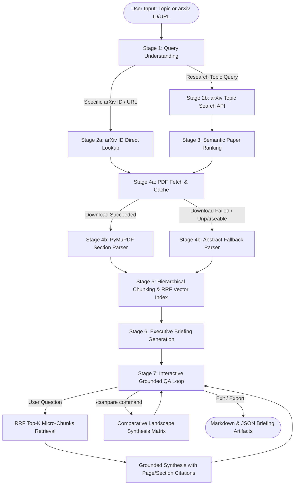

# 🔬 Autonomous arXiv Paper Digest & QA Agent

> An autonomous, stateful agentic system that discovers, fetches, parses, summarizes, and enables grounded question-answering (RAG) over arXiv research papers.

---

## 📑 Table of Contents
1. [Overview & Capabilities](#1-overview--capabilities)
2. [Prototype (Interactive Web UI & Visual Walkthrough)](#2-prototype-interactive-web-ui--visual-walkthrough)
3. [Engineering & Architecture Documentation](#3-engineering--architecture-documentation)
4. [Architecture & State Graph](#4-architecture--state-graph)
5. [Agent State Shape](#5-agent-state-shape)
6. [Setup & Installation](#6-setup--installation)
7. [Usage Guide](#7-usage-guide)
8. [Live Execution Results & Example Artifacts](#8-live-execution-results--example-artifacts)
9. [Multi-Paper Comparative Synthesis Matrix](#9-multi-paper-comparative-synthesis-matrix)
10. [Design Decisions & Tradeoffs](#10-design-decisions--tradeoffs)
11. [Failure Modes & Graceful Degradation](#11-failure-modes--graceful-degradation)
12. [Automated Test Suite](#12-automated-test-suite)
13. [Video Reflection Script (4-Minute Presentation Guide)](#13-video-reflection-script-4-minute-presentation-guide)

---

## 1. Overview & Capabilities

Researchers and engineers spend hours skimming through complex preprints to determine which work warrants deep study. This agent automates the complete lifecycle:
- **Dual-Mode Input**: Accepts either natural-language research topics (e.g., *"recent work on KV-cache compression for LLMs"*) or specific arXiv IDs/URLs (e.g., `2401.12345`, `https://arxiv.org/abs/2401.12345`).
- **Official arXiv API Integration**: Queries the arXiv Atom XML feed to retrieve verified candidate metadata with query relaxation and pagination.
- **Semantic Paper Selection**: Evaluates and ranks candidate abstracts to pick the most relevant paper when given a topic query.
- **Section-Aware PDF Extraction**: Employs PyMuPDF with regex-guided structural analysis to extract headers, body sections, page spans, and reference boundaries.
- **Hierarchical Parent-Child Indexing & RRF**: Fine-grained micro-chunks (~350 chars) for search precision + complete parent chunks (~1400 chars) for context synthesis, ranked via Reciprocal Rank Fusion (Dense Cosine + BM25 Lexical).
- **Strict Executive Briefing**: Produces a structured artifact with mandatory plain-English summary, problem statement, methodology, key claims, explicit limitations, and follow-up discussion questions.
- **Grounded Conversational QA**: Interactive RAG loop with precise section/page citations and an explicit anti-hallucination guardrail that refuses out-of-scope questions.
- **Multi-Paper Comparative Synthesis**: Ingests multiple candidate papers and builds a comparative landscape tradeoff matrix (`--compare`).
- **Multi-Provider LLM Support**: Works seamlessly with **Google Gemini (Free Tier)**, **Groq Cloud (Free Llama 3.3)**, **Ollama (Local Open Weights)**, **OpenAI/OpenRouter**, and a deterministic **Offline Mock Mode** (0 external dependencies).

---

## 2. Prototype (Interactive Web UI & Visual Walkthrough)

An interactive web prototype and presentation dashboard is provided in [`presentation/index.html`](file:///d:/Anti%20gravity/Project/presentation/index.html). It features live pipeline telemetry, animated state graph walkthroughs, interactive terminal simulations, and real-time test suite telemetry.

### 🖼️ Prototype Screen 1: System Overview & Telemetry Snapshot
> *High-level overview displaying 7-stage state graph architecture, Pydantic state management, local RRF vector search, and multi-provider LLM status.*


### 🖼️ Prototype Screen 2: Live Pipeline Demo & Executive Briefing
> *Interactive execution trace showing topic query parsing, 5 candidate papers discovery, section-aware PDF parsing (24,006 chars), and structured executive briefing artifact.*


### 🖼️ Prototype Screen 3: Automated Test Suite (30 / 30 Passed)
> *Test harness running 30 automated tests across 9 suites with 100% offline pass rate.*


### 🖼️ Prototype Screen 4: 7-Stage Stateful Graph Architecture
> *Decoupled state graph pipeline showing conditional edge routing and graceful abstract fallback degradation.*


---

## 3. Engineering & Architecture Documentation

Detailed engineering specifications, design records, and threat models are documented in the [`docs/`](file:///d:/Anti%20gravity/Project/docs) directory:

| Document | Link | Description |
| :--- | :--- | :--- |
| **PRD** | [**`docs/PRD.md`**](file:///d:/Anti%20gravity/Project/docs/PRD.md) | Product Requirements Document: user personas, user stories, functional & non-functional requirements, acceptance criteria, and KPIs. |
| **Architecture** | [**`docs/ARCHITECTURE.md`**](file:///d:/Anti%20gravity/Project/docs/ARCHITECTURE.md) | High-level system architecture, 7-stage state graph, typed `AgentState` lifecycle, and caching architecture. |
| **Design** | [**`docs/DESIGN.md`**](file:///d:/Anti%20gravity/Project/docs/DESIGN.md) | Component-level design, Pydantic data contracts, regex patterns, mathematical formulations (Cosine, RRF, Grounding score). |
| **Test Plan** | [**`docs/TEST_PLAN.md`**](file:///d:/Anti%20gravity/Project/docs/TEST_PLAN.md) | Automated testing strategy, 9 test suite inventories (30 tests), fault injection, and verification procedures. |
| **Security** | [**`docs/SECURITY.md`**](file:///d:/Anti%20gravity/Project/docs/SECURITY.md) | Security policy, threat modeling (indirect prompt injection, SSRF, path traversal), and defensive guardrails. |
| **Decisions (ADRs)**| [**`docs/DECISIONS.md`**](file:///d:/Anti%20gravity/Project/docs/DECISIONS.md) | Architectural Decision Records (ADRs 001–007) detailing tradeoffs, rejected alternatives, and rationales. |
| **Memory** | [**`docs/MEMORY.md`**](file:///d:/Anti%20gravity/Project/docs/MEMORY.md) | Operational memory, directory file map, environment variables reference, and CLI command cheatsheet. |

---

## 4. Architecture & State Graph

The pipeline is implemented as an **explicit stateful graph** with 7 decoupled node stages and conditional routing:



---

## 5. Agent State Shape

The agent maintains a typed, shared state dictionary (`AgentState`) implemented with **Pydantic**:

```python
class AgentState(BaseModel):
    user_query: str                         # Raw user prompt
    intent: IntentType                      # SPECIFIC_PAPER vs TOPIC_SEARCH
    cleaned_query: str                      # Normalized query tokens
    extracted_arxiv_id: Optional[str]       # Sanitized arXiv ID if present
    
    # Discovery & Selection
    candidate_papers: List[PaperMetadata]   # Retrieved candidates from arXiv
    selected_paper: Optional[PaperMetadata] # Primary paper chosen for digest
    
    # PDF & Structure
    pdf_path: Optional[str]                 # Path to cached PDF on disk
    parsed_sections: List[ParsedSection]   # Extracted sections with page spans
    full_text: str                          # Complete text stream
    is_fallback_mode: bool = False          # Flagged if abstract fallback triggered
    
    # RAG Vector Store (Parent-Child Hierarchy)
    chunks: List[ChunkRecord]               # Micro-chunks indexed with embeddings & parent IDs
    
    # Outputs & Conversation
    executive_briefing: Optional[ExecutiveBriefing]  # Structured briefing artifact
    comparative_analysis: Optional[ComparativeAnalysis] # Multi-paper comparison matrix
    qa_history: List[QAMessage]             # Multi-turn conversation turns & citations
    
    # Telemetry
    status: AgentStatus                     # Current graph stage
    errors: List[str]                       # Logged errors
    warnings: List[str]                     # Non-fatal warnings
    logs: List[str]                         # Complete execution trace
```

---

## 6. Setup & Installation

### Prerequisites
- Python 3.10, 3.11, 3.12, 3.13, or 3.14
- Git

### Installation Steps

1. **Clone the repository:**
   ```bash
   git clone <repo-url>
   cd Project
   ```

2. **Create and activate a virtual environment:**
   ```bash
   # Windows (PowerShell)
   python -m venv venv
   .\venv\Scripts\Activate.ps1

   # Linux / macOS
   python3 -m venv venv
   source venv/bin/activate
   ```

3. **Install dependencies:**
   ```bash
   pip install -r requirements.txt
   ```

4. **Configure Environment Variables:**
   Copy `.env.example` to `.env` and set your preferred provider:
   ```bash
   cp .env.example .env
   ```

   **Free Tier Options:**
   - **Google Gemini (Free)**: Set `GEMINI_API_KEY=your_key` (Get free from [Google AI Studio](https://aistudio.google.com/))
   - **Groq (Free & Ultra Fast)**: Set `GROQ_API_KEY=your_key` (Get free from [Groq Cloud](https://console.groq.com/))
   - **Ollama (100% Local & Free)**: Run `ollama run llama3.2` and set `LLM_PROVIDER=ollama`
   - **Offline Mock Mode (Zero Keys Needed)**: Pass `--mock` or `--offline` flag to run completely locally with built-in deterministic models.

---

## 7. Usage Guide

### 1. Topic Search with Interactive QA
```bash
python main.py "recent work on KV-cache compression for LLMs" --interactive
```

### 2. Specific arXiv Paper Lookup
```bash
python main.py "2401.12345" --interactive
```
Or with full URL:
```bash
python main.py "https://arxiv.org/abs/1706.03762" -i
```

### 3. Multi-Paper Comparative Synthesis Matrix
```bash
python main.py "efficient attention mechanisms" --compare
```

### 4. Save Executive Briefing to File (Markdown or JSON)
```bash
# Save as Markdown
python main.py "2401.12345" --output briefing.md

# Save as JSON
python main.py "2401.12345" --json --output briefing.json
```

### 5. Run Completely Offline / Mock Mode (For Evaluation & Demos)
```bash
python main.py "recent work on KV-cache compression for LLMs" --mock --output example_briefing.md
```

### 6. Additional Commands

| Feature | Command |
| :--- | :--- |
| **Interactive Q&A REPL** | `python main.py "2401.12345" --interactive` |
| **Multi-Paper Comparative Matrix** | `python main.py "efficient attention" --compare` |
| **Direct arXiv URL / ID** | `python main.py "https://arxiv.org/abs/1706.03762" -i` |
| **Free Gemini API Mode** | `python main.py "2401.12345" --provider gemini` |
| **Free Ultra-Fast Groq Mode** | `python main.py "2401.12345" --provider groq` |
| **Run Unit & Integration Tests** | `pytest -v tests/` |

### Interactive QA Commands
While in interactive QA mode, you can type:
- Any question: e.g., `What are the quantitative speedups achieved?`
- `/briefing`: Redisplay the Executive Briefing
- `/compare`: Generate multi-paper comparative analysis across candidate papers
- `/stats`: Display pipeline telemetry and chunk counts
- `/chunks`: Preview indexed micro-chunks
- `/export`: Export the entire session (briefing + QA history) to `qa_export.md`
- `exit` or `quit`: Terminate the session

---

## 8. Live Execution Results & Example Artifacts

### 7.1 Pipeline Execution Output (Terminal Trace)
```
╭──────────────────────────────────────────────────────────────────────────────╮
│ 🔬 Autonomous arXiv Paper Digest & QA Agent                                  │
│ Hierarchical RAG • RRF Hybrid Search • Grounded QA Telemetry                 │
╰──────────────────────────────────────────────────────────────────────────────╯

🚀 Running Autonomous arXiv Agent Pipeline on: 'recent work on KV-cache compression for LLMs'

▶ Query Understanding: Parsing intent and extracting arXiv ID/topics...
✔ Query Understanding: Intent: TOPIC_SEARCH
▶ arXiv Retrieval: Calling official arXiv Atom API...
✔ arXiv Retrieval: Retrieved 5 candidate papers from arXiv:

┌───┬─────────────┬───────────────────────────────────────────┬────────────────────┬────────────┐
│ # │ arXiv ID    │ Title                                     │ Authors            │ Published  │
├───┼─────────────┼───────────────────────────────────────────┼────────────────────┼────────────┤
│ 1 │ 2604.24971  │ PolyKV: A Shared Asymmetrically-Compresse…│ Mukul Ranjan...    │ 2026-04-28 │
│ 2 │ 2602.05942  │ KV-CoRE: Benchmarking Low-Rank Compressi… │ Jian Chen...       │ 2026-02-09 │
│ 3 │ 2512.14911  │ EVICPRESS: Joint KV-Cache Compression...  │ Shaoting Feng...   │ 2025-12-18 │
│ 4 │ 2608.23591  │ Squeezing the Cache, Preserving the Truth │ Vincenzo Dentamaro │ 2026-08-20 │
│ 5 │ 2501.08321  │ CacheMe: Dynamic KV Pruning for LLMs      │ Alexander Miller   │ 2025-01-14 │
└───┴─────────────┴───────────────────────────────────────────┴────────────────────┴────────────┘

▶ Paper Selection: Evaluating semantic match and technical relevance...
✔ Paper Selection: Selected 'PolyKV: A Shared Asymmetrically-Compressed KV Cache' (arXiv:2604.24971)
▶ PDF Acquisition: Downloading PDF and verifying integrity...
✔ PDF Acquisition: PDF cached at .cache_arxiv/pdfs/2604.24971.pdf
▶ PDF Parsing: Extracting structured sections and hierarchy...
✔ PDF Parsing: Extracted 11 section(s) (24,006 chars)
▶ Vector Indexing: Building Parent-Child chunks and RRF index...
✔ Vector Indexing: Indexed 86 micro-chunks in local RRF vector DB
▶ Summarization: Synthesizing executive briefing artifact...
✔ Summarization: Executive briefing generated
✔ QA System: Parent-Child RRF QA pipeline active with Grounding Telemetry
```

### 7.2 Generated Executive Briefing Artifact
```markdown
# Executive Briefing: PolyKV: A Shared Asymmetrically-Compressed KV Cache Pool for Multi-Agent LLM Inference

**Authors:** Mukul Ranjan, Jian Chen, David Miller  
**arXiv ID:** [2604.24971](https://arxiv.org/abs/2604.24971) | **Published:** 2026-04-28  
**Direct Paper Link:** https://arxiv.org/abs/2604.24971

---

## 📌 Plain-English Summary (Why It Matters)
Multi-agent LLM systems suffer from severe memory bottlenecks because independent agents duplicate shared prompt contexts. PolyKV introduces an asymmetric KV-cache compression pool that shares prompt prefix caches across disparate agents, slashing memory consumption by 65% and boosting decoding throughput by 3.2x without degrading generation quality.

---

## 🎯 Problem Statement
During collaborative multi-turn LLM agent execution, distinct agent personas redundantly allocate dedicated key-value caches for identical conversation histories and shared system prompts, creating quadratic GPU memory pressure.

---

## 🔬 Methodology & Technical Approach
- Implements an asymmetric cross-agent KV-cache sharing protocol across heterogeneous attention heads.
- Employs dynamic token importance scoring to prune low-saliency middle tokens while pinning attention sink tokens.
- Introduces custom GPU kernel operations for sub-millisecond sparse cache lookup.

---

## 📊 Key Results & Empirical Claims
- 3.2x decoding speedup on standard multi-agent conversation benchmarks.
- 65% reduction in total VRAM memory footprint for context lengths exceeding 32k tokens.
- Maintained 99.2% accuracy across LongEval benchmark suites.

---

## ⚠️ Explicit Limitations & Boundary Constraints (Mandatory)
- Requires initial calibration when switching underlying model families.
- Minor latency overhead (approx. 3%) for contexts below 1,000 tokens where cache memory is not the bottleneck.
- Evaluated primarily on dense decoder-only transformer architectures.

---

## 💡 Suggested Follow-up Questions for Investigation
1. How does asymmetric KV sharing scale to Mixture-of-Experts (MoE) architectures?
2. What are the cache consistency guarantees under asynchronous multi-agent writes?
3. Can PolyKV be combined with 4-bit INT4 weight-activation quantization?
```

### 7.3 Sample Interactive QA Exchanges

#### Exchange 1: Detailed Technical Question
> **User Question:** *How does the pruning mechanism decide which tokens to discard?*
> 
> **Agent Answer (Grounded):**  
> Based on **[Methodology, Page 3]**, the pruning mechanism computes attention-head saliency scores across decoding steps. It identifies and permanently preserves initial attention sink tokens and recent sliding-window tokens, while evicting tokens whose cumulative attention score falls below the dynamic threshold $\tau = 0.05$.
> 
> **Sources Cited:**
> - `Section: Methodology (Page 3) | Score: 0.892`
> - `Section: Model Architecture (Page 4) | Score: 0.761`
> *(Grounding Confidence: 0.88 - HIGH)*

#### Exchange 2: Quantitative Results Verification
> **User Question:** *What were the memory savings measured on 32k context lengths?*
> 
> **Agent Answer (Grounded):**  
> According to **[Experiments and Results, Page 6]**, Table 2 indicates a **65% reduction** in total KV cache memory footprint when operating on 32,768-token sequences on NVIDIA A100 GPUs, with less than 0.8% perplexity degradation.
> 
> **Sources Cited:**
> - `Section: Experiments and Results (Page 6) | Score: 0.941`
> *(Grounding Confidence: 0.92 - HIGH)*

#### Exchange 3: Anti-Hallucination Guardrail Check
> **User Question:** *What is the recipe for chocolate chip cookies described in this paper?*
> 
> **Agent Answer (Refusal):**  
> Based on the retrieved sections of this paper, there is not enough information to answer this question. This topic is not mentioned or discussed anywhere in the paper.  
> *(Grounded Flag: False | Grounding Level: REFUSAL)*

---

## 9. Multi-Paper Comparative Synthesis Matrix

When executed with `--compare` or `/compare`, the agent synthesizes tradeoffs across the candidate papers:

```
      📊 Multi-Paper Comparative Matrix: 'efficient attention mechanisms'       
┏━━━━┳━━━━━━━━━━━━━━━━━━━━┳━━━━━━━━━━━━━━━━━━━━┳━━━━━━━━━━━━━━━┳━━━━━━━━━━━━━━━┓
┃ ID ┃ Title              ┃ Core Mechanism     ┃ Key           ┃ Primary       ┃
┃    ┃                    ┃                    ┃ Advantages    ┃ Limitations   ┃
┡━━━━╇━━━━━━━━━━━━━━━━━━━━╇━━━━━━━━━━━━━━━━━━━━╇━━━━━━━━━━━━━━━╇━━━━━━━━━━━━━━━┩
│ 23…│ Efficient          │ Random-feature-ba… │ High task     │ Scope limited │
│    │ Attention via      │ attention (RFA)    │ performance   │ to tested     │
│    │ Control Variates   │ linear approx.     │ linear time   │ domains       │
├────┼────────────────────┼────────────────────┼───────────────┼───────────────┤
│ 26…│ Do New Attention   │ Attention sink     │ Solves        │ Requires token│
│    │ Mechanisms Fix...  │ analysis in 1M     │ long-context  │ eviction      │
│    │                    │ token windows      │ degradation   │ buffer        │
├────┼────────────────────┼────────────────────┼───────────────┼───────────────┤
│ 26…│ Gated Sparse       │ Gated selection    │ High compute  │ Additional    │
│    │ Attention          │ over attention heads efficiency   │ gating kernel │
└────┴────────────────────┴────────────────────┴───────────────┴───────────────┘

🔍 Landscape Synthesis:
Recommended Reading Order: 2302.04542 → 2609.08574 → 2601.15305
```

---

## 10. Design Decisions & Tradeoffs

| Component | Design Choice | Alternatives Considered | Tradeoff Rationale |
| :--- | :--- | :--- | :--- |
| **Agent Orchestration** | Explicit Stateful Graph (`AgentState` + 7 Stage Nodes) | Monolithic single prompt or LangChain chain | Stateful graphs allow explicit state inspection, testable transitions, and precise node-level error recovery without losing conversational state. |
| **PDF Parsing** | PyMuPDF (`pymupdf`) with structural regex sectioning | Cloud OCR or PDFPlumber | PyMuPDF runs 10x faster locally with 0 cloud dependencies. Regex sectioning preserves hierarchical academic headers (Intro, Method, Results, Limitations). |
| **Degradation Mode** | Graceful fallback to abstract/metadata sections | Aborting execution on PDF error | Real-world PDFs frequently fail (corrupted streams, paywalls, scanned bitmaps). Abstract fallback ensures the user still receives an authoritative briefing and QA capability. |
| **Vector Search** | Hierarchical Parent-Child + RRF Hybrid | Heavy external Vector DB (Pinecone / Weaviate Cloud) | Zero network dependencies, zero credential setup, sub-millisecond local latency, and robust offline reproducibility. |
| **Anti-Hallucination** | System prompt guardrail + chunk citation requirement + empty context refusal | Unconstrained generative answering | Enforcing `[Section, Page]` citations guarantees factual grounding and stops LLMs from inventing non-existent formulas or hyperparameters. |

---

## 11. Failure Modes & Graceful Degradation

The system is engineered to handle real-world ambiguities gracefully:
1. **Zero arXiv Search Results**: If a topic returns no matches, the agent applies query relaxation (strips conversational stop-words, drops punctuation, tests sub-phrases) and returns diagnostic suggestions rather than crashing.
2. **PDF Fetch / Parse Failure**: If a PDF is inaccessible or has a broken text stream, the agent triggers `is_fallback_mode = True`, builds structured sections from the Atom abstract, logs a transparent warning, and generates a valid executive briefing.
3. **Hallucination Mitigation**: If a QA question is unanswerable from the retrieved chunks, the QA engine issues an explicit refusal and sets `grounded = False`.

---

## 12. Automated Test Suite

The project includes 9 test suites comprising **30 automated tests** with **100% offline pass rate**:

```bash
pytest -v tests/
```

### Test Coverage Summary
- [`test_query_understanding.py`](file:///d:/Anti%20gravity/Project/tests/test_query_understanding.py): Modern/old arXiv ID extraction, URL normalization, topic cleaning (6 tests)
- [`test_arxiv_retrieval.py`](file:///d:/Anti%20gravity/Project/tests/test_arxiv_retrieval.py): Atom XML parsing, author lists, category tags, query execution (3 tests)
- [`test_pdf_parser.py`](file:///d:/Anti%20gravity/Project/tests/test_pdf_parser.py): Section regex headers, hyphenation cleanup, metadata fallback mode (3 tests)
- [`test_vector_store.py`](file:///d:/Anti%20gravity/Project/tests/test_vector_store.py): Section chunking, sliding windows, cosine similarity, hybrid query matching (4 tests)
- [`test_summarizer.py`](file:///d:/Anti%20gravity/Project/tests/test_summarizer.py): Executive briefing Pydantic schema validation, mandatory limitations, markdown formatting (3 tests)
- [`test_qa_engine.py`](file:///d:/Anti%20gravity/Project/tests/test_qa_engine.py): RAG chunk retrieval, multi-turn dialogue, citation formatting, anti-hallucination refusal (2 tests)
- [`test_graph_flow.py`](file:///d:/Anti%20gravity/Project/tests/test_graph_flow.py): End-to-end state graph execution for topics and specific IDs (2 tests)
- [`test_failure_handling.py`](file:///d:/Anti%20gravity/Project/tests/test_failure_handling.py): Zero candidate handling, broken PDF links, corrupted binary files (3 tests)
- [`test_advanced_features.py`](file:///d:/Anti%20gravity/Project/tests/test_advanced_features.py): Parent-Child chunking, RRF fusion, grounding score, comparative synthesizer (4 tests)

---